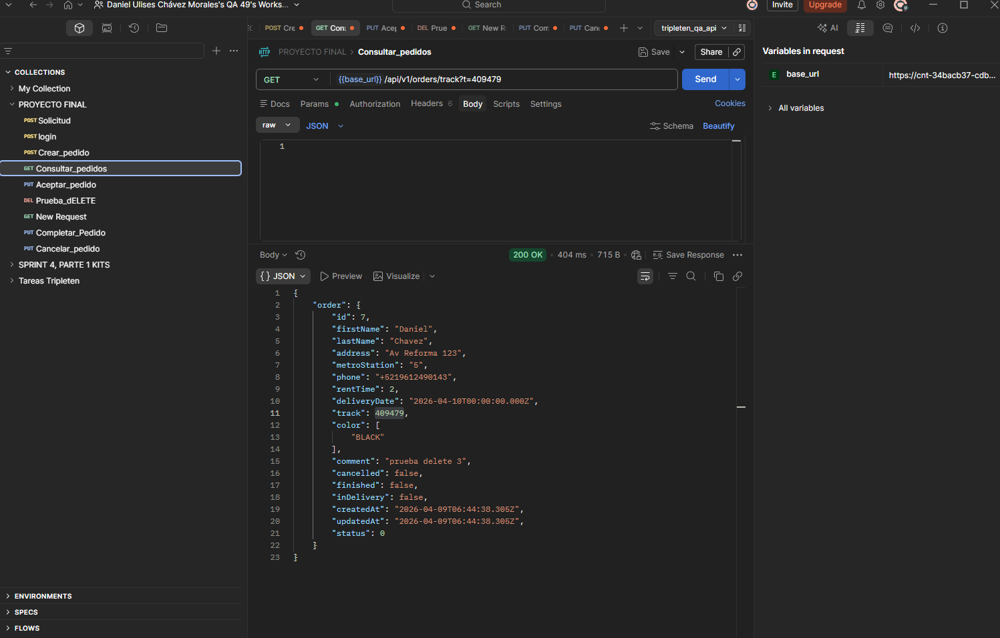
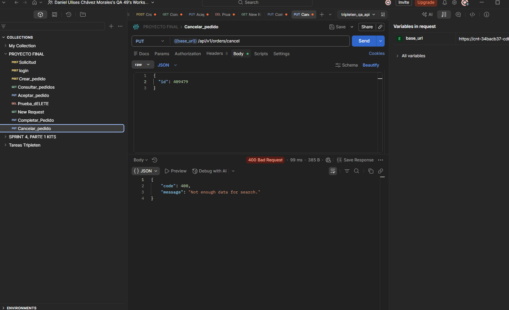
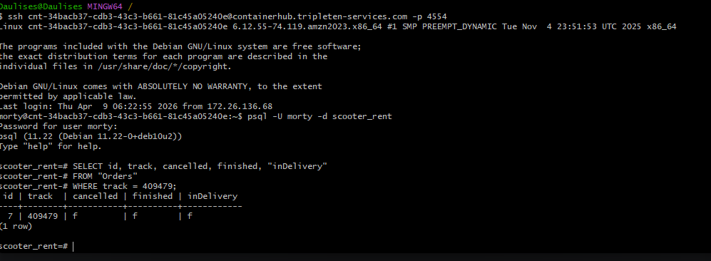
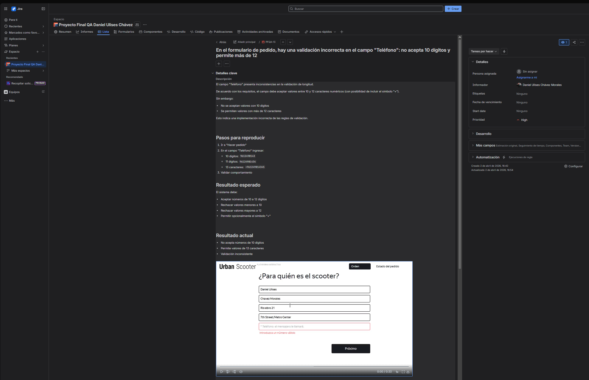
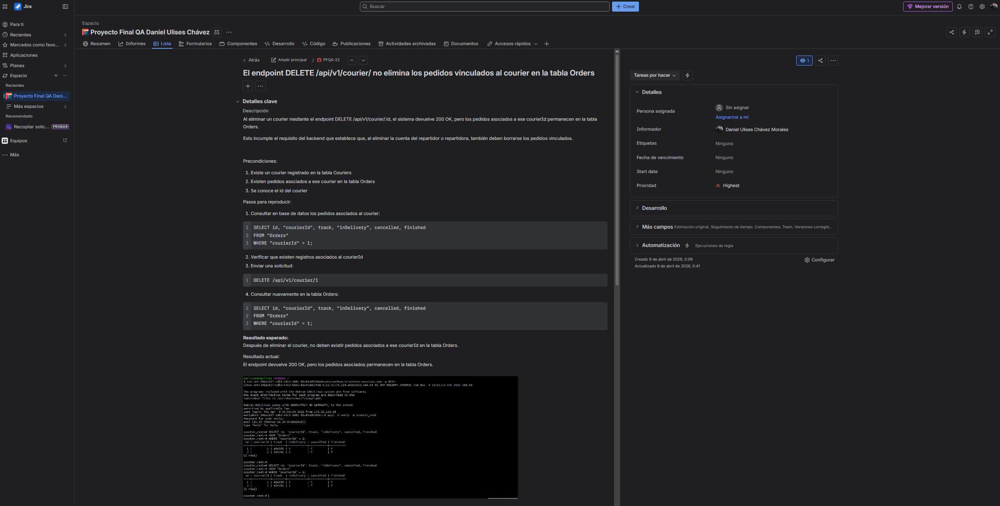

# 🧪 QA Testing Project – Aplicación de Pedidos y Repartidores

## 📌 Descripción
Proyecto de pruebas QA enfocado en la validación funcional y de API de una aplicación de gestión de pedidos y repartidores.  
Se realizaron pruebas manuales estructuradas para identificar defectos en flujos críticos, validación de datos y lógica de negocio.

---

## 🎯 Objetivo
Garantizar la calidad del sistema mediante la ejecución de pruebas funcionales, validación de API REST y pruebas de regresión, detectando errores que afectan la experiencia del usuario y la estabilidad del sistema.

---

## 🔍 Alcance de pruebas

- Pruebas funcionales (UI y lógica de negocio)
- Pruebas exploratorias
- Pruebas de regresión
- Validación de datos de entrada
- Testing de API REST
- Validación de manejo de errores

---

## 🧪 Técnicas de testing utilizadas

- Clases de equivalencia  
- Análisis de valores límite  
- Casos positivos y negativos  
- Listas de comprobación (checklists)

---

## 🛠 Herramientas utilizadas

- Postman (API Testing)  
- Jira (gestión de bugs)  
- Excel (documentación de pruebas)  
- Chrome DevTools  
- GitHub  

---

## 📂 Estructura del proyecto

El proyecto incluye:

- ✔️ Lista de comprobación (checklist de funcionalidades)  
- ✔️ Validación de datos de entrada  
- ✔️ Casos de prueba detallados  
- ✔️ Pruebas de API (checklist de endpoints)  
- ✔️ Documentación de defectos detectados  

---

## 🔎 Funcionalidades probadas

- Registro de repartidores  
- Creación y cancelación de pedidos  
- Consulta de pedidos por track ID  
- Validación de estados de pedidos  
- Validación de campos obligatorios  
- Manejo de datos inválidos  

---

## 🐞 Resultados de testing

Durante la ejecución de pruebas se detectaron múltiples defectos, entre ellos:

- ❌ Errores en validación de datos (inputs inválidos aceptados)  
- ❌ Manejo incorrecto de estados en pedidos  
- ❌ Respuestas incorrectas en API ante datos incompletos  
- ❌ Fallos en flujos críticos del sistema  

Estos defectos fueron documentados con pasos claros de reproducción, resultados esperados vs obtenidos y evidencia.

---

## 📈 Conclusiones

El sistema presenta áreas de mejora en:

- Validación de datos  
- Manejo de errores en API  
- Consistencia en lógica de negocio  

Las pruebas realizadas permitieron identificar defectos que impactan directamente la estabilidad del sistema y la experiencia del usuario.

---

## 🚀 Habilidades demostradas

- Diseño de casos de prueba efectivos  
- Identificación y documentación de bugs  
- Validación de APIs REST  
- Análisis de requisitos  
- Testing basado en escenarios reales  

---

## 📎 Archivo completo del proyecto

Puedes consultar el documento completo de pruebas aquí:

👉 [QA Testing Project – Excel](./Files/QA_Testing_Project_Daniel_Chavez.xlsx)

## 📸 Evidencia de pruebas

## 🐞 Defectos y validaciones relevantes

Durante la ejecución de pruebas se identificaron defectos en la validación de datos, funcionamiento de endpoints y consistencia en base de datos, los cuales impactan directamente la lógica de negocio del sistema.

---

### 🔹 API Testing – Consulta de pedido (caso exitoso)
Se valida la obtención de información de un pedido mediante el endpoint `GET /api/v1/orders/track`.

✔️ Resultado: Respuesta correcta con código 200 OK y estructura JSON esperada.

---

### 🔹 API Testing – Error en cancelación de pedido
El endpoint `/api/v1/orders/cancel` devuelve un error 400 incluso cuando se envían parámetros válidos.

❌ Problema: El endpoint no procesa correctamente la solicitud, impidiendo cancelar pedidos.

---

### 🔹 Validación en base de datos
Se realiza validación directa en base de datos para verificar el estado del pedido tras ejecutar operaciones.

❌ Problema: El estado del pedido no cambia después de la operación esperada, indicando inconsistencia entre backend y base de datos.

---

### 🔹 Bug – Validación incorrecta en teléfono
El campo "Teléfono" no cumple con las reglas de validación definidas.

❌ Problemas detectados:
- No acepta números válidos de 10 dígitos  
- Permite valores mayores a 12 caracteres  
- Validación inconsistente  

---

### 🔹 Bug – Eliminación de courier no elimina pedidos relacionados
El endpoint `DELETE /api/v1/courier/:id` elimina el courier, pero no elimina los pedidos asociados en la base de datos.

❌ Problema:
Se generan registros huérfanos, lo que afecta la integridad de los datos.

---

## 👨‍💻 Autor

**Daniel Ulises Chávez Morales**  
QA Engineer Jr  

🔗 LinkedIn: https://www.linkedin.com/in/daniel-ulises-chavez-morales/  
🔗 GitHub: https://github.com/daulises  
